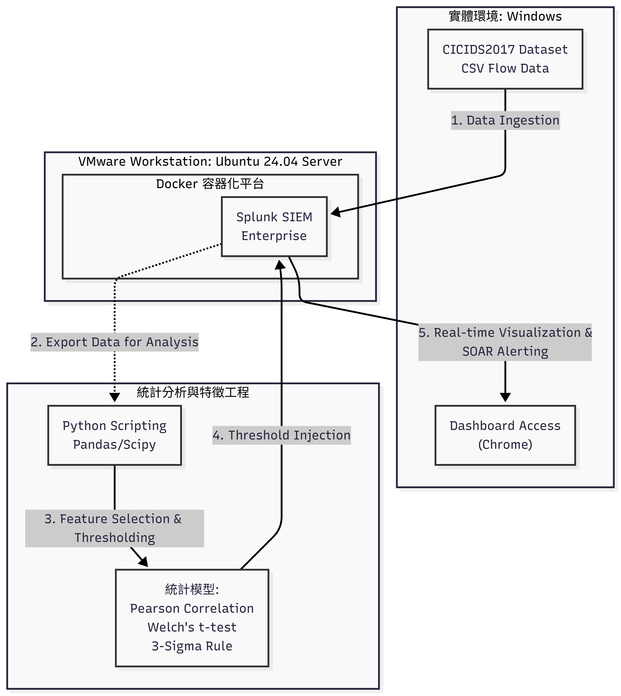
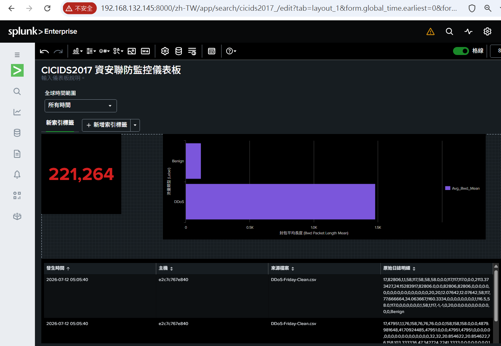
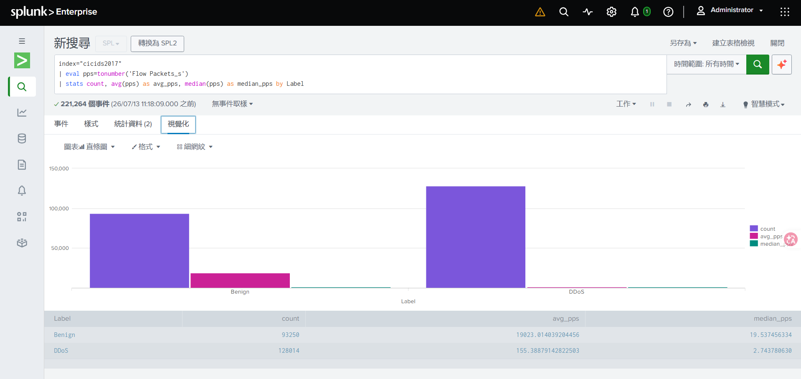
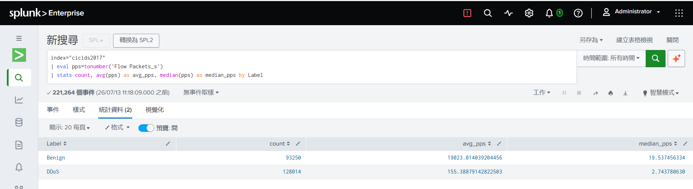

# 資安威脅偵測流水線：Splunk 與統計分析

## 專案概述
本專案建立了一套資料驅動的資安威脅偵測流水線，專注於 DDoS 攻擊的識別。透過結合高階統計分析與 SIEM（資安資訊與事件管理）平台，本系統能有效進行異常偵測、建立運作基準（Baseline），並將威脅模式視覺化。

## 系統架構

## 實作流程

### 1. 環境建置
基礎設施建置於 VMware Workstation 的 Ubuntu 虛擬機中，並利用 Docker 部署 Splunk Enterprise。
* **存取點：** [http://192.168.132.145:8000](http://192.168.132.145:8000)

### 2. 資料導入
將 CICIDS2017 資料集（`DDoS-Friday-Clean.csv`）導入 Splunk 平台，並設定索引（Index）以支援高效能的日誌分析。

### 3. 統計分析與特徵工程
開發 Python 程式（運用 Pandas 與 Scipy）以提取與 DDoS 活動相關的關鍵特徵。分析流水線包含：
* **皮爾森相關係數 (Pearson Correlation Coefficient)：** 用於識別高影響力的特徵關聯。
* **Welch's t-test：** 對識別出的特徵進行統計顯著性檢定。
* **三倍標準差法則 (3-Sigma Rule)：** 建立穩健的運作基準，用於異常偵測。

### 4. 可視化儀表板
根據統計分析的結果，在 Splunk 中撰寫自定義 SPL（搜尋處理語言）查詢，產生自動化、即時的威脅監控視覺化模板。

#### 統計驗證與結果
以下視覺化圖表展示了資料處理流程以及在 Splunk 介面中的 SPL 查詢結果：

